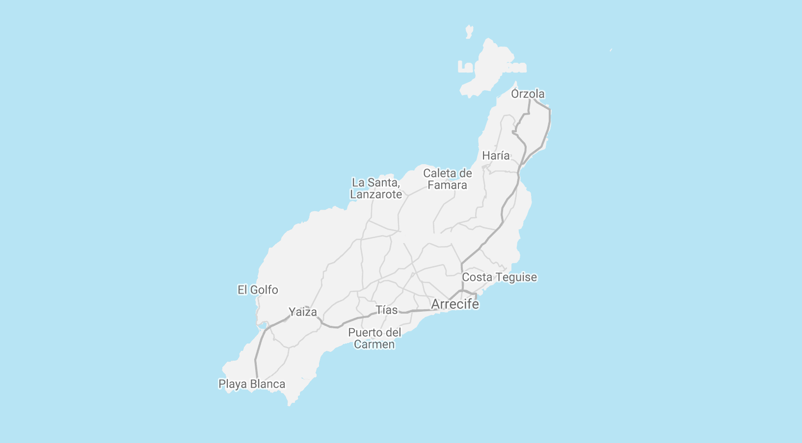

# 🏝 - Lanzarote

## 👁 See

### Manrique places

- [CACT](https://www.cactlanzarote.com/)
    - Casa-Museo del Campesino: free, must visit (CACT)
    - Jameos del Agua: must visit (CACT)
    - Jardin de cactus: must visit (CACT)
    - Mirador del Rio : must visit (CACT)
    - Montanas del Fuego : nice (CACT)
    - Castillo de San José : nice (CACT)

- [the Fundacion Cesar Manrique](http://fcmanrique.org/)
    - Casa del volcan: must visit (FUNDACION)
    - Casa del palmeral: must visit (FUNDACION)

### More

- lag-o-mar, which is a quite spectacular house that was build by Manrique
- Cueva de los verdes, which is a walk in a cave. Can be coolwith kids.
- Los Hervideros on the east side is very spectacular to visit too.
- Driving through Timanfaya is cool too of course, same goes for La Geria

### Cute villages

- Yaiza ,
- Teguise,
- Haria,
- Playa quemada

### Beach wise

- Papagayo,
- Quemada
- beaches up north (Mara)
- nude beach of Charco del Polo are the most surprising.

### Other great views

- The Mirador del Rio,
- mirador de haria ,
- Barranco La Elvira (view over Famara).

### Hike

- La Graciosa
- GR route definitely are great fun.

## 👄 Eat

- La Cantina (Teguise)
- Bistro Arbol (Puerto del Carmen)
- v factor (arrecife)
But there are plenty of restaurants which offer great variations of options.

## 💤 Stay

Cute hotels: Casa Nube, Buenavista Suites Lanzarote
